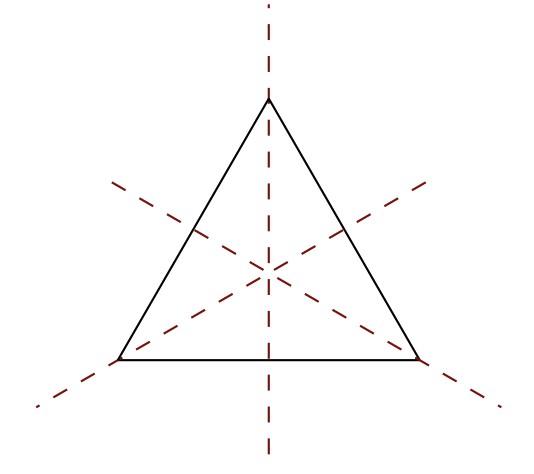

# Lecture 1 - Introduction

## Introduction

Group theory is an example of algebra. In algebra, instead of limiting our study to the manipulation of symbols (e.g. $$1 + 1, 2^n, ...$$), we allow the set of objects and operations to be anything, not just numbers. However, such a definition is too broad and therefore we categorize algebraic structures into different types, with _**groups**_ being one of them (and also _**rings**_, _**modules**_, ...).

In order to classify these structures, we need to have certain _**axioms**_, which say that the operations must follow certain rules, and the focus of group theory is the study of _**symmertries**_.

## Concrete Definition of Group

**A group is the set of symmetries of something, and symmetry of something is just a way of mapping something to itself perserving all the structures.**

To be more concrete, consider the symmetries of an equilateral triangles.

<figure><figcaption>
(From Dexter Chua's Notes)
</figcaption></figure>

If we limit ourselves to preserve everything, we would only be allowed to do nothing. When studying the symmetries of the equilateral triangle, we only care about how the resultant objects look, but don't care about where the individual vertices went. Hence, we have six symmetries: three rotations (by $$0 \degree, 120 \degree, 240 \degree$$) and three reflections along the above axes. These six form the underlying set of the group of symmetries. With that, we can then define the operation being the combination of two symmetries to give a new symmetry, naturally meaning to do one after another, e.g. combining two $$120 \degree$$ rotation to get a $$240 \degree$$ rotation.

However, as we are studying algebra not geometry, we will abstract away the triangle and definite the group to have a set of six objects, say $$\{ e, r, r^2, s, rs, r^2s \}$$ ($$e$$ is doing nothing, $$r$$ is the rotation and $$s$$ is the reflection). Base on that, we can define rules about how we combine them by observing its properties.

First of all, we must have a "do nothing" symmetry, which when combined with another symmetry, the other symmetry is unchanged. It is called the identity element, normally named as $$1, 0$$ or $$e$$.

Secondly, given a symmetry, we should have the reverse symmetry, which when combined the two together, we will end up "doing nothing", i.e. getting the identity element. It is called the inverse and normally named as $$a^{-1}$$.

Finally, let $$\ast$$ denote the group operation, given three symmetries, we can combine them, one after another, i.e. $$x \ast y \ast z$$. There are two ways to combine them, which are $$(x \ast y) \ast z$$ or $$x \ast (y \ast z)$$. However, intuitively they should yield the same result as we are always applying $$x$$ after $$y$$ after $$z$$, we have the associative rule $$(x \ast y) \ast z = x \ast (y \ast z)$$.

With the above, we can define the axioms of a group.

## Abstract Definition of Group - Group Axioms

**\[Definition of binary operation]** A (binary) operation is a ways of combining two elements to get a new element. Formally, it is a map $$\ast: S \times S \to S$$.

**\[Definition of Group]** A group is a set $$G$$ with a binary operation $$\ast$$ satifying the following axioms:&#x20;

1. **\[Identity]** There is some $$e \in G$$ such that for all $$a \in G$$, we have:

$$
a \ast e = e \ast a = a
$$

2. **\[Inverse]** For all $$a \in G$$, there is some $$a^{-1} \in G$$ such that:

$$
a^{-1} \ast a = a \ast a^{-1} = e
$$

3. **\[Associativity]** For all $$a, b, c \in G$$, we have

$$
(a \ast b) \ast c = a \ast (b \ast c)
$$

There can also be a zeroth axiom called "**Closure**", which means for all $$a, b \in G$$, we have $$a \ast b \in G$$. Technically it is always true base on the definition of binary operation $$\ast$$ but in practice it might be something we have to check.

We dervied the abstract notion of a group from its concrete notion by taking the combination of symmetries as the binary operation. Conversely, it is also true by [Cayley's Theorem](lecture-2-cayleys-theorem.md), meaning these are the only axioms we need to define a group.

With this abstract definition, we can already study lots of properties about groups.

## Goal of Group Theory

1. Classify all groups (up to isomorphism)
2. Classify all the ways a group is symmetries of something (Representation Theory)

## References

* [Dexter Chua, Part IA - Groups, 2014 - Chapter 0](https://dec41.user.srcf.net/notes/IA\_M/groups.pdf)
* [https://youtu.be/RnqwFpyqJFw?list=PL8yHsr3EFj51pjBvvCPipgAT3SYpIiIsJ](https://youtu.be/RnqwFpyqJFw?list=PL8yHsr3EFj51pjBvvCPipgAT3SYpIiIsJ)
